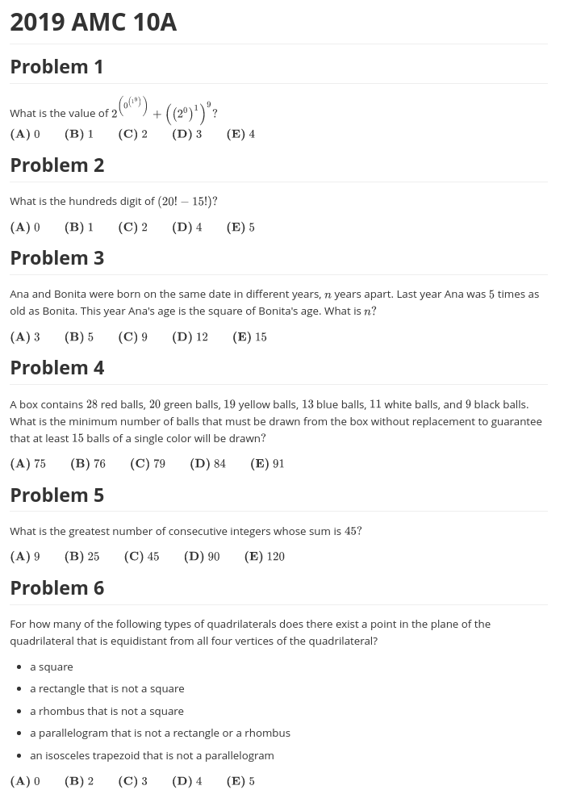

# PrepAMC
Quick script to download an AMC 10/12 test from AoPS, format it, and get it ready to print

**Usage:**

```bash
$ prepamc <year: 20__> <test: 10A/10B/12A/12B/AIME1/AIME2> [destination file]
```

**Example:**

```bash
$ prepamc 2019 10a 2019-AMC-10A.md
```

### Screenshot

The Markdown files outputted look like this:


